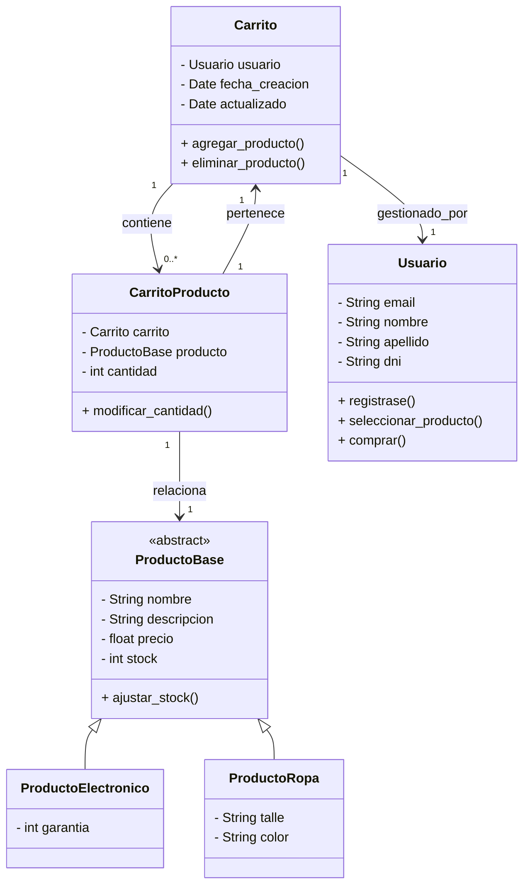
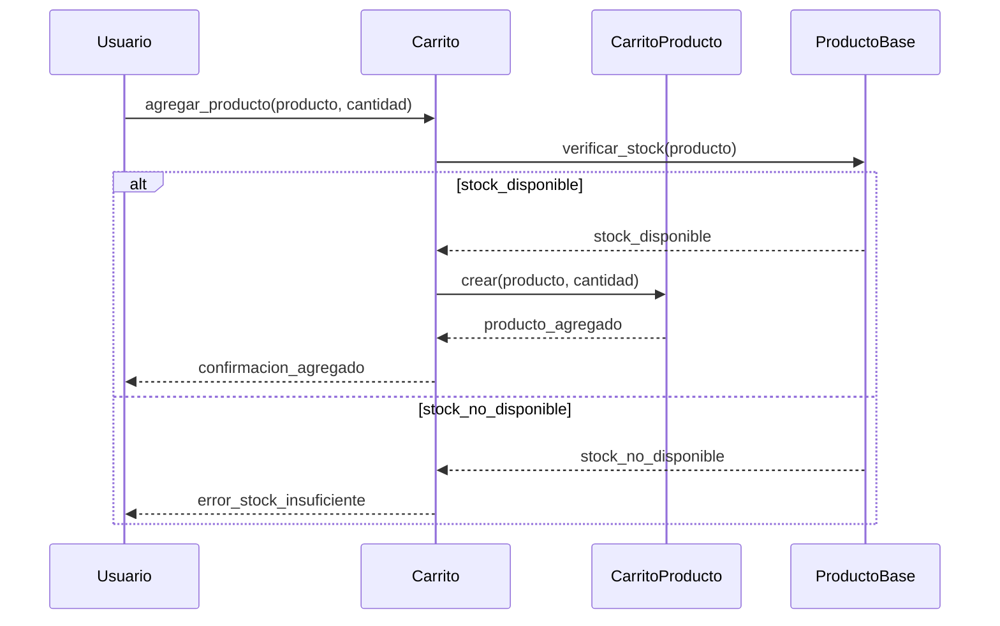
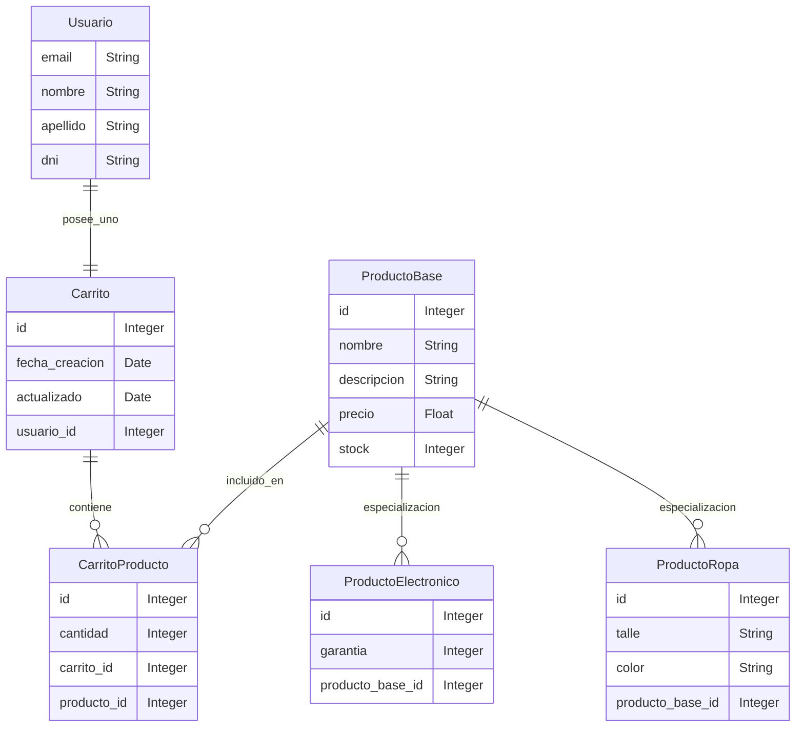

Cuando clonen el repositorio tiene que ejecutar: " pip install -r requirements.txt " con ese se instalan todas las dependencias.

### Diagrama de Clases

### Diagrama de Secuencia

### Diagrama Entidad - Relación

### Diccionario de Datos

- **Usuario**
  - email: String - Correo electrónico del usuario.
  - nombre: String - Nombre del usuario.
  - apellido: String - Apellido del usuario.
  - dni: String - Documento Nacional de Identidad del usuario.

- **Carrito**
  - id: Integer - Identificador único del carrito.
  - fecha_creacion: Date - Fecha de creación del carrito.
  - actualizado: Date - Fecha de la última actualización del carrito.
  - usuario_id: Integer - Identificador del usuario que posee el carrito.

- **ProductoBase**
  - id: Integer - Identificador único del producto.
  - nombre: String - Nombre del producto.
  - descripcion: String - Descripción del producto.
  - precio: Float - Precio del producto.
  - stock: Integer - Cantidad de producto disponible en inventario.

- **ProductoElectronico** (hereda de ProductoBase)
  - id: Integer - Identificador único del producto electrónico.
  - garantia: Integer - Duración de la garantía del producto electrónico en meses.
  - producto_base_id: Integer - Identificador del producto base asociado.

- **ProductoRopa** (hereda de ProductoBase)
  - id: Integer - Identificador único del producto de ropa.
  - talle: String - Talla de la prenda.
  - color: String - Color de la prenda.
  - producto_base_id: Integer - Identificador del producto base asociado.

- **CarritoProducto**
  - id: Integer - Identificador único de la relación carrito-producto.
  - cantidad: Integer - Cantidad del producto en el carrito.
  - carrito_id: Integer - Identificador del carrito asociado.
  - producto_id: Integer - Identificador del producto asociado.

### Relaciones

- Un **Usuario** posee uno **Carrito**.
- Un **Carrito** contiene múltiples **CarritoProducto**.
- Un **ProductoBase** está incluido en múltiples **CarritoProducto**.
- **ProductoElectronico** y **ProductoRopa** son especializaciones de **ProductoBase**.

